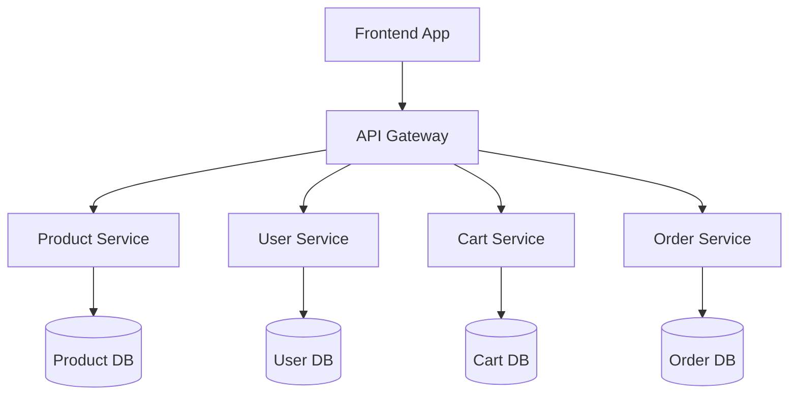

# 📘 Subham E-Commerce API Documentation

## 📌 Overview
This API allows clients (web/mobile/front-end) to interact with the backend services of **Subham**, a microservices-based e-commerce platform. It includes endpoints for products, users, carts, orders, and admin functionalities.

> 🔗 **Swagger UI**: `http://localhost:2610/swagger-ui.html`  
> 📄 **OpenAPI Spec**: `http://localhost:2610/v3/api-docs`

---

## ⚙️ API Info

| Attribute       | Description                              |
|----------------|------------------------------------------|
| **Title**       | Subham E-Commerce API                   |
| **Version**     | 1.0.0                                   |
| **Description** | REST API for Subham backend services    |
| **Base URL**    | `http://localhost:2610` (Dev environment) |

---

## 🗂️ Architecture Diagram



---

## 📂 API Modules

### 🛒 Product Service

| Method | Endpoint             | Description                     |
|--------|----------------------|---------------------------------|
| GET    | `/api/products`      | Get list of all products        |
| GET    | `/api/products/{id}` | Get product by ID               |
| POST   | `/api/products`      | Create a new product (Admin)    |
| PUT    | `/api/products/{id}` | Update product details (Admin)  |
| DELETE | `/api/products/{id}` | Delete a product (Admin)        |

---

### 👤 User Service

| Method | Endpoint               | Description                     |
|--------|------------------------|---------------------------------|
| POST   | `/api/users/register`  | Register a new user             |
| POST   | `/api/users/login`     | Authenticate user               |
| GET    | `/api/users/profile`   | Get user profile                |

---

### 🛍️ Cart Service

| Method | Endpoint               | Description                     |
|--------|------------------------|---------------------------------|
| GET    | `/api/cart`            | Get current user's cart         |
| POST   | `/api/cart/add`        | Add product to cart             |
| DELETE | `/api/cart/remove/{id}`| Remove product from cart        |

---

### 📦 Order Service

| Method | Endpoint               | Description                     |
|--------|------------------------|---------------------------------|
| POST   | `/api/orders`          | Place a new order               |
| GET    | `/api/orders/{id}`     | Get order details               |
| GET    | `/api/orders/user`     | Get current user's orders       |

---

## 🔒 Authentication

Uses **JWT (JSON Web Token)** for secured access.  
Include the token in the `Authorization` header:

```
Authorization: Bearer <token>
```

---

## 📦 Response Format

All responses follow this format:

```json
{
  "timestamp": "2025-06-17T10:32:00",
  "status": 200,
  "message": "Success",
  "data": { ... }
}
```

---

## 📑 OpenAPI Tags

Use annotation in controller for grouping in Swagger UI:

```java
@Tag(name = "Products", description = "Backend API for Subham microservices-based e-commerce app")
```

---

## ✅ Status Codes

| Code | Description             |
|------|-------------------------|
| 200  | Success                 |
| 201  | Created                 |
| 400  | Bad Request             |
| 401  | Unauthorized            |
| 404  | Resource Not Found      |
| 500  | Internal Server Error   |
